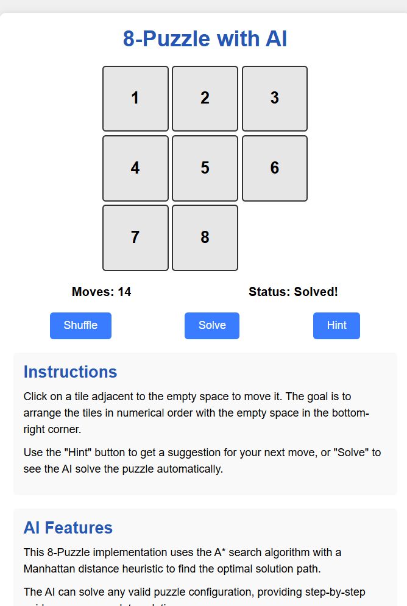

# 8-Puzzle Solver Game



**About This Project**  
This project is my first game and my first AI project, developed for the AI class at my university.  
It was a valuable learning experience in both game development and artificial intelligence algorithms.

---

A classic 8-puzzle game with AI-powered solving and hint features, built using Python and Pygame.

---

## 🌐 Play Online

If you want to play or test the game online, click here:  
**[▶️ Play Now](https://r19hninck55d.manus.space/)**

---

## Features

- Interactive 8-puzzle game (3x3 grid)
- "New Game" button to shuffle and start a new puzzle
- "Hint" button (Greedy Best-First Search AI)
- "Solve" button (A* algorithm with Manhattan Distance heuristic)
- Move counter and timer
- Visual feedback for hints and solved state
- All puzzles are guaranteed to be solvable

---

## 🚀 Installation (Step-by-Step)

### 1. Clone the Repository

Open your terminal or command prompt and run:
```bash
git clone https://github.com/mawlid1431/AI_project0.git
cd AI_project0
```

### 2. Install Python

Make sure you have **Python 3.10+** installed.  
You can download it from [python.org](https://www.python.org/downloads/).

### 3. Install Dependencies

Install all required Python packages using:
```bash
pip install -r requirements.txt
```
If you only want to run the game, you can just install pygame:
```bash
pip install pygame
```

---

## 🕹️ How to Run Locally

To start the game on your computer, run:
```bash
python puzzle.py
```
A game window will open, and you can start playing!

---

## 🎮 How to Play

- **Move tiles:** Click on any tile adjacent to the empty space to move it.
- **New Game:** Click "New Game" to shuffle and start a new puzzle.
- **Hint:** Click "Hint" to highlight the best next move (AI suggestion).
- **Solve:** Click "Solve" to watch the AI solve the puzzle automatically.
- **Goal:** Arrange the tiles in order (1-8) with the empty space at the bottom right.

---

## 🤖 AI Algorithms

- **Hint:** Uses Greedy Best-First Search to suggest the next best move.
- **Solve:** Uses the A* algorithm with Manhattan Distance heuristic to find the optimal solution path.

---

## 📂 Source Code

You can find all the source code in this repository.  
- The main game logic is in `puzzle.py`.
- The web interface (if used) is in `app.py`.

Feel free to explore, modify, and learn from the code!

---

## 📝 License

This project is for educational purposes.

---

## 👤 Credits

Developed by Mawlid1431.